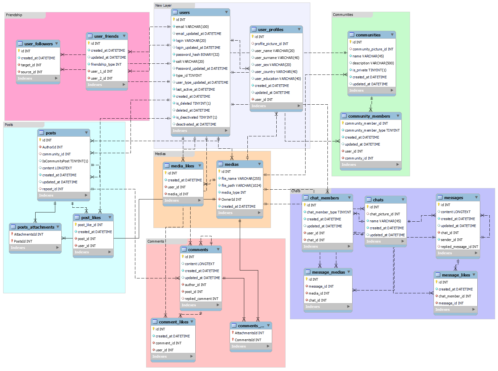

# Social-Network API

This project is an API for a social network platform, providing functionality for users, friends, communities, chats, posts, and media management.

### Features:

- Cookies authorization
- Policy-based authorization
- 3-Tier architecture
- Swagger documentation

### Technologies:

- [ASP.NET Core 7.0](https://dotnet.microsoft.com/en-us/)
- [Entity Framework Core](https://learn.microsoft.com/en-us/ef/core/)
- [FluentValidation](https://docs.fluentvalidation.net/en/latest/)
- [AutoMapper](https://automapper.org/)
- [Swagger](https://learn.microsoft.com/en-us/aspnet/core/tutorials/web-api-help-pages-using-swagger?view=aspnetcore-7.0)

### API Endpoints

You can find the detailed API documentation and endpoints on the [Swagger Page](https://app.swaggerhub.com/apis/NAZARMASUKOV/Social-Network/v3).

### Database Schema

